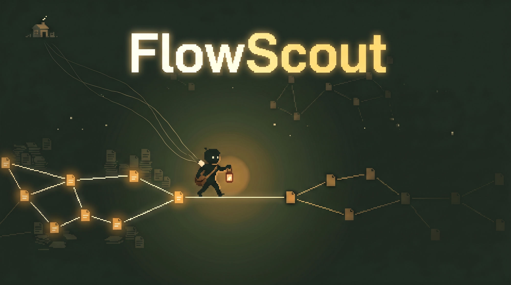

<p align="center">
  
</p>

# FlowScout

> An agent swarm that reads research papers before YouTube does.

FlowScout is a Claude Code command bundle that turns a single paper URL into a structured corpus, walks the citation graph in your sleep, mines cross-paper theses, and verifies them against the open literature. Designed for operators who want an edge in AI (or any fast-moving research field) before the primitives get wrapped in a brand.

Five commands. One overnight loop. One open-source repo.

## What it does

```
  /digest-paper      one paper, one structured digest
        ↓
  /citation-walk     follow the citation graph (broad, deep, canonical, orbit)
        ↓
  /research-cycle    chain all four walking modes plus longitudinal synthesis
        ↓
  /flow-frontier     mine falsifiable cross-paper theses from the corpus
        ↓
  /verify-thesis     adversarial verification against the open literature
```

Wrap any command in `/loop` and walk away. Cycle 3 of the system that built this repo produced **34 new paper digests, a 5,716-word synthesis, and 23 falsifiable theses overnight**.

Read the full journey in [Outrunning the AI Hype Train](https://thecognitiveshift.com/publications/let-them-run/outrunning-the-ai-hype-train) on *The Cognitive Shift*.

## Install

### Option 1: Tell Claude Code to install it

Open Claude Code in your second-brain directory and say:

> Install FlowScout from https://github.com/RhysEJF/flowscout

Claude will read the `INSTALL.md` in this repo and copy the commands and skills into the right places.

### Option 2: One-line bash

From the root of your second-brain directory:

```bash
curl -sSL https://raw.githubusercontent.com/RhysEJF/flowscout/main/install.sh | bash
```

### Option 3: Manual

```bash
git clone https://github.com/RhysEJF/flowscout.git /tmp/flowscout
cp /tmp/flowscout/commands/*.md  ./.claude/commands/
cp -R /tmp/flowscout/skills/*    ./skills/
mkdir -p ./scripts && cp /tmp/flowscout/scripts/*.py ./scripts/
```

## Usage

Once installed, all five commands are available as Claude Code slash commands.

**Digest a single paper:**
```
/digest-paper https://arxiv.org/abs/2109.02157
```

**Walk citations from a seed:**
```
/citation-walk arxiv.org/abs/2109.02157 --topic="vector-symbolic encodings" --broad
```

**Run an overnight research cycle:**
```
/loop /research-cycle "agentic memory architectures"
```

**Mine theses across your corpus:**
```
/flow-frontier --topic="agentic memory" --max-papers=20
```

**Verify all open theses:**
```
/verify-thesis --all-open
```

## The five commands

| Command | What it does | Reads | Writes |
|---|---|---|---|
| `/digest-paper` | URL to structured markdown digest. TLDR, key takeaway, method, figure, citations, "what experts overlook." Lens-tailored (multiple personas per paper). | Web (paper URL) | `memory/knowledge-sources/papers/<slug>.md` |
| `/citation-walk` | Walks the citation graph in four modes: `--broad` (all refs), `--deep` (follow the thread), `--canonical` (foundational works in the wiki), `--orbit` (lateral discovery via mutated takeaways). | A seed digest + the wiki | `experiences/citation-walk/<run>/` + new digests |
| `/research-cycle` | Chains all four citation-walk modes in sequence on a single topic, plus a longitudinal meta-digest that compounds across runs. Designed to be wrapped by `/loop`. | The wiki + a topic | A per-cycle synthesis |
| `/flow-frontier` | Mines cross-paper theses across five gap-types: convergence, unstated-assumption, mechanism-gap, edge-of-consensus, direct contradiction. Emits falsifiable theses. | The wiki | `experiences/theses/<slug>.md` |
| `/verify-thesis` | Generates adversarial search queries per thesis, runs them through Exa + WebSearch, scores candidates as supports/contradicts/qualifies/irrelevant, synthesises a verdict, drafts an experiment if the thesis stays open. | A thesis + the open literature | Updated thesis file with verdict |

## Multiple corpora — researching more than one field

A **corpus** is one body of research: a subdirectory of the papers wiki with its own `INDEX.md`, figures, and viewer. Pass `--corpus=<slug>` to any command (or set `FLOWSCOUT_CORPUS`) and everything scopes to it:

```
memory/knowledge-sources/papers/
├── corpora.md                  # registry of corpora
├── agentic-memory/             # one research stream
│   ├── INDEX.md
│   ├── figures/
│   └── <slug>.md (+ -notes.md sidecars)
└── reef-ecology/               # a completely different one
    └── ...

experiences/
├── citation-walk/<corpus>/<run>/
├── research-cycle/<corpus>/cycle-N-<topic>-<date>/
├── theses/<corpus>/            # per-corpus INDEX.md + _manifest.json
└── verify-thesis/<corpus>/<run-id>/
```

The isolation rules:

- **Corpus-scoped**: seed-picking, centrality, canonical tallies, related-digest linking, thesis mining, viewer browsing. A new topic's deep-walk can never get seeded with another field's hub paper.
- **Global**: paper dedup. A paper digested in any corpus is never re-digested; if it's relevant to a second corpus, the skills add a pointer row to that corpus's INDEX instead.
- **Resolution**: `--corpus=` > `FLOWSCOUT_CORPUS` > the sole existing corpus (silent) > ask. With one corpus you never need the flag.

Starting a new field is just: `/research-cycle "coral reef acoustics" --corpus=reef-ecology` — the corpus directory, INDEX, and registry row are created on first digest.

**Upgrading from the flat layout?** Existing installs with digests directly in `papers/` keep working (the tools detect the legacy layout and operate on the root). To adopt corpora, move your digests + `INDEX.md` + `figures/` + sidecars into `papers/<corpus-name>/`, move `experiences/theses/*` into `experiences/theses/<corpus-name>/`, create `papers/corpora.md` with one row, and reindex QMD.

## Browsing your corpus

FlowScout ships with a lightweight HTML viewer (`skills/digest-paper/viewer-template.html`) that auto-installs to `memory/knowledge-sources/papers/viewer.html` the first time you run `/digest-paper`. Open it in a browser to scroll your digests, search them, and click through to the markdown source. It is a single self-contained file with no build step.

For basic browsing, any static file server works (`python3 -m http.server 8000` from the papers directory). To also get the viewer's annotation feature (highlight text in a digest, attach a note — stored as plain markdown sidecars QMD and Obsidian can read) and the theses tab, run the bundled server instead:

```bash
python3 scripts/papers-server.py   # then open http://localhost:8000/viewer.html
```

**Obsidian, Logseq, or similar users**: point your vault at `memory/knowledge-sources/papers/` and you can ignore the viewer entirely. The digests are plain markdown with YAML frontmatter, so your existing tooling will pick them up — each corpus is a folder, and Obsidian's Bases (core plugin) gives you a sortable table view per corpus filtered on the `corpus` frontmatter property or folder. The bundled viewer exists because I had not adopted Obsidian when I built this and wanted something quick I could read in the browser. Might build a richer one on top of it later.

## Prerequisites

- **[Claude Code](https://claude.com/claude-code)** installed (CLI or IDE extension)
- **python3** for the bundled helper scripts in `scripts/` (cross-sub-agent locking, the viewer server, `/research-cycle` bookkeeping). `/research-cycle` additionally needs PyYAML: `pip3 install pyyaml`
- **An Exa API key** for orbit mode and verify-thesis (set as `EXA_API_KEY` in your shell, or via the [Exa MCP](https://github.com/exa-labs/exa-mcp-server))
- **A second brain with these conventions**:
    - `memory/knowledge-sources/papers/<corpus>/` for paper digests
    - `experiences/citation-walk/<corpus>/` for walk runs
    - `experiences/theses/<corpus>/` for mined theses

  These are the [Flow OS](https://thecognitiveshift.com/training) defaults. If your second brain uses different paths, edit the `SKILL.md` files in `skills/<command>/` to match. The path conventions are the only Flow OS-specific assumption FlowScout makes.
- Optional: a hybrid search engine (Flow OS uses [QMD](https://github.com/tobi/qmd) for corpus-wide search inside `--orbit` and `--canonical` modes). The commands degrade gracefully without it.

## Compose your own loops

Each command stands alone. You can chain them however you like:

```bash
# Build coverage on one topic over a week
for topic in "neuromorphic computing" "in-context learning theory" "RLHF alternatives"; do
  /research-cycle "$topic"
done

# Then mine the whole corpus
/flow-frontier --refresh

# Then verify everything
/verify-thesis --all-open
```

Or wrap the lot in `/loop` and go to bed.

## Roadmap

FlowScout is alpha. Things on the list:

- [x] Multiple corpora: per-field subdirectories (`--corpus=<slug>`) so research streams don't mix
- [ ] Path config: a single `flowscout.toml` to override `memory/knowledge-sources/papers/` etc.
- [ ] Second-brain adapters (Obsidian, Logseq, Notion export folders)
- [ ] Built-in scheduling without needing `/loop`
- [ ] A richer viewer (tags, full-text search across digests) on top of the bundled HTML one
- [ ] LaTeX-to-figure extractor for arxiv source tarballs (current version uses PDF screenshots)

PRs welcome. Issues even more welcome.

## Why "FlowScout"

An outrider that scouts the literature ahead of the brand. Reads papers while you sleep. Reports back with theses you can be first to test.

The "Flow" half nods at [Flow OS](https://thecognitiveshift.com/training), the second brain it was built inside. FlowScout is the first piece of Flow OS that makes sense as a standalone tool, because reading papers is a job everyone has.

## License

MIT. See [LICENSE](./LICENSE).

## Credits

Built by [Rhys Fisher](https://x.com/virtual_rf) inside [Flow OS](https://thecognitiveshift.com/training). The full story of how it was built, command by command, is in [Outrunning the AI Hype Train](https://thecognitiveshift.com/publications/let-them-run/outrunning-the-ai-hype-train).

If you run FlowScout on something interesting, tell me. I want to know what edges other operators are finding while the YouTubers are still rendering their thumbnails.
